# Academia.edu Public-Registry Snapshot — Business Analysis

A scraped snapshot of the public researcher registry on Academia.edu, covering **324,775 researchers across all 89 publicly-discoverable university subdomains and 7,939 departments** — the complete public-registry footprint accessible without authentication. This document is a business-focused read-out of what the data says about the platform, the institutions it covers, and the people who use it. Every claim references a specific chart in `charts/`.

> **📥 Dataset download (120 MB, too large for GitHub):**
> [**kaggle.com/datasets/ismetsemedov/academia**](https://www.kaggle.com/datasets/ismetsemedov/academia/data)

---

## 1. Executive Summary

- **The platform is a discoverability shell, not a participation venue.** 86.0% of researchers have uploaded zero papers, 51.7% have zero followers, and 64.4% have *none* of (bio, public email, profile photo) populated. Only 1.85% — about 1 in 54 — have a fully completed profile. ([Chart 12](charts/12_papers_distribution.png), [Chart 22](charts/22_completeness_distribution.png))
- **Growth has stopped.** 50.4% of every researcher in the registry was created in just 2019–2020. From 2021 onwards, only 1.59% of accounts have been added — a near-total collapse in new sign-ups (or in the platform's ability to surface them publicly). ([Chart 7](charts/07_accounts_per_year.png))
- **Attention is extremely concentrated.** The top 1% of researchers (3,247 accounts) hold **56.6% of all followers**; the top 100 alone hold 34.2%. The most-followed researcher is Daniel Hershenzon at the University of Connecticut with **255,610 followers** — a long-tail outlier of platform fame. ([Chart 15](charts/15_followers_vs_papers_scatter.png), [Chart 16](charts/16_top_followed_researchers.png))
- **Coverage is broadly distributed across institutions.** The largest single university (UCLA) is only 3.16% of the dataset; the top 10 universities account for 25.8% of researchers. There is no coverage-skew warning. ([Chart 2](charts/02_top_universities_by_count.png), [Chart 6](charts/06_coverage_spread.png))
- **The platform's quality signals are sparse.** 98.5% of researchers carry the floor `author_rank` of 1, and only **0.87% (2,811 researchers)** are flagged `bragworthy` — the editorial highlight signal. ([Chart 24](charts/24_author_rank_distribution.png), [Chart 26](charts/26_bragworthy_share_by_university.png))
- **Per-researcher engagement is *inversely* related to university size.** The composite Academic Visibility Index is led by small, research-dense institutions (Field Museum, Hiroshima, SISSA, UConn), not the big-headcount names like UCLA or HKU. Big universities dilute their metrics with thousands of dormant accounts. ([Chart 32](charts/32_academic_visibility_index.png), [Chart 28](charts/28_headcount_vs_avg_followers.png))
- **For any product built on this data, gmail.com is the *primary* contact channel** — among the 3.5% of researchers who publish an email, **26.0% (2,955 of 11,377) use a personal `gmail.com` address**, more than any single institutional domain. That has direct implications for verification, deliverability, and trust.

---

## 2. Dataset Overview

| Field | Value |
|---|---|
| Source | `https://{subdomain}.academia.edu/` |
| Scrape pipeline | `scripts/scraper.py` (asyncio + curl_cffi + aiohttp + aiofiles, Cloudflare-bypass via Chrome TLS fingerprint) |
| **Live dataset (download)** | **[kaggle.com/datasets/ismetsemedov/academia](https://www.kaggle.com/datasets/ismetsemedov/academia/data)** — published there because the CSV exceeds GitHub's 100 MB file-size limit |
| Snapshot frozen at | 2026-05-27 (analysis file: `data/data.snapshot.csv`, 120 MB — *not* in this repo) |
| Total researchers (rows) | **324,775** |
| Universities (distinct subdomains) | **89** — complete public-directory coverage |
| Departments | **7,939** |
| Columns | 24 |
| Format | UTF-8 CSV, no BOM |

This is a **public-registry snapshot**, not an activity stream. The only time dimension that can be analysed is `created_at` (account creation timestamp). Engagement numbers (`followers_count`, `papers_count`) are point-in-time totals as observed by the scraper, not deltas.

The scraper completed a full pass through every Academia.edu university subdomain discoverable from the homepage (the public-directory universe). Of those 89, exactly one (`independent`) was unreachable; the remaining 88 are fully represented in this snapshot.

---

## 3. Data Quality Summary

Recomputed against the live data (324,775 rows):

| Column | Empty rate | Treatment |
|---|---|---|
| `middle_initials` | 99.06% | Drop from analysis |
| `public_email` | 96.50% | Treat empty as "no public email"; report contactability as a headline metric |
| `about` | 94.65% | Treat empty as "no public bio" |
| `papers_count` | 85.98% | Empty = 0 papers (verified against source) — imputed to 0 |
| `followers_count` | 51.71% | Empty = 0 followers — imputed to 0 |
| `following_count` | 16.82% | Empty = 0 — imputed to 0 |
| `author_rank` / `bragworthy` | 0.27% | Treated as missing for ranked analysis |
| `first_name` / `last_name` | <0.01% | Effectively complete |
| `department_name` | <0.01% | Negligible |

**Invariants checked, all passed:**
- 0 duplicate `user_id`
- 0 duplicate `(subdomain, page_name)`
- 0 duplicate `profile_url`
- `subdomain` ↔ `university_id` ↔ `university_name` are strictly 1-to-1
- `(university_id, department_id)` maps to exactly one `department_name`
- `subdomain` extracted from `profile_url` matches the `subdomain` column on all 324,775 rows
- `has_photo == False` perfectly aligns with `photo_url == /images/s65_no_pic.png`

The dataset is **byte-perfect** — no corruption, no orphan rows, no cross-key drift, no row losses across multiple resumed scraper runs.

---

## 4. Coverage Disclosure

**No single-university dominance.** UCLA is the largest single subdomain at **3.16%** of all rows; the top 5 together are 14.3%. The dataset is broadly distributed, so per-university and per-country comparisons can be made without coverage-skew caveats.

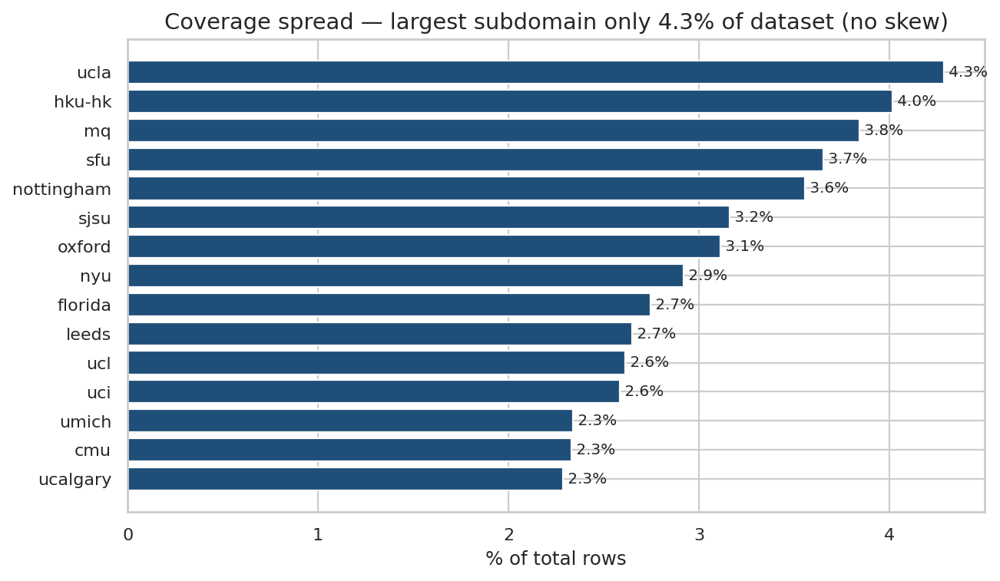

The scraper reached all 89 publicly-discoverable Academia.edu subdomains. One (`independent`) returned an unreachable homepage during the scrape and is excluded — the remaining 88 are fully represented. This is the complete addressable public footprint of the platform as visible to a logged-out browser; the analysis can be read as the full universe, not a sample.

---

## 5. Key Findings

### 5.1 University Size

**Finding A — A long, flat distribution of institution sizes.** Researcher counts per university range from a handful (specialty institutes) to ~10,000 (UCLA, HKU, Macquarie, SFU, Nottingham, Texas-Austin). The median university has roughly 2,500 researchers; the top 20 universities account for 41% of all records.

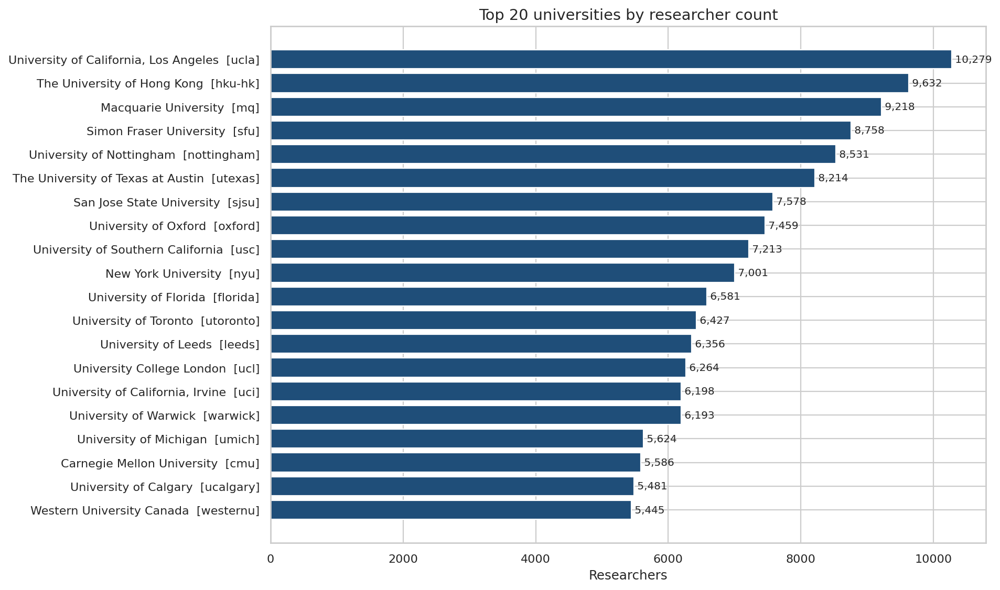
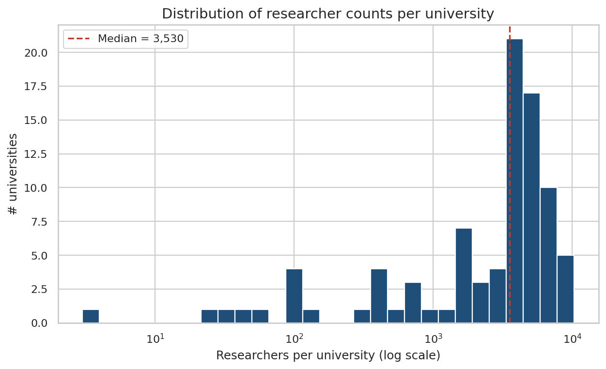

**Why it matters:** for a research-platform vendor sizing the market, this means **no single account-acquisition deal** unlocks more than ~3% of the population — partnership strategy must be multi-institution.

**Finding B — Department counts are skewed by big-tent business and computer-science programs.** The top 30 departments are all business schools, CS departments, or arts/social-science faculties at the largest universities, each holding 700–1,000 researchers.

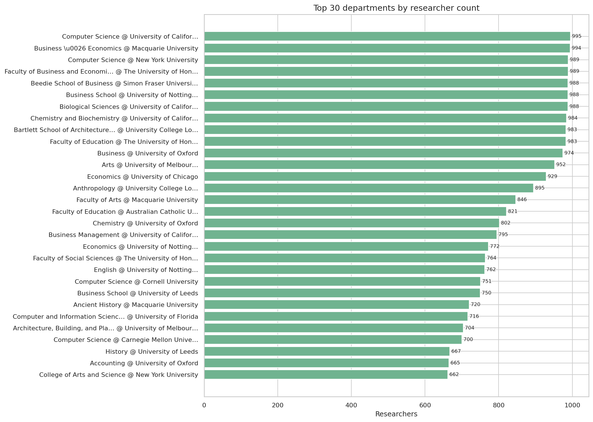

**Why it matters:** academic-talent vendors targeting specific fields can hit a meaningful audience by going department-deep at five or six institutions, rather than chasing breadth.

---

### 5.2 Engagement

**Finding C — The "zero club" is the dominant population.** 279,234 researchers (86.0%) have not uploaded a single paper, and 167,955 (51.7%) have zero followers. The platform is a directory for most users, not a publishing workflow.

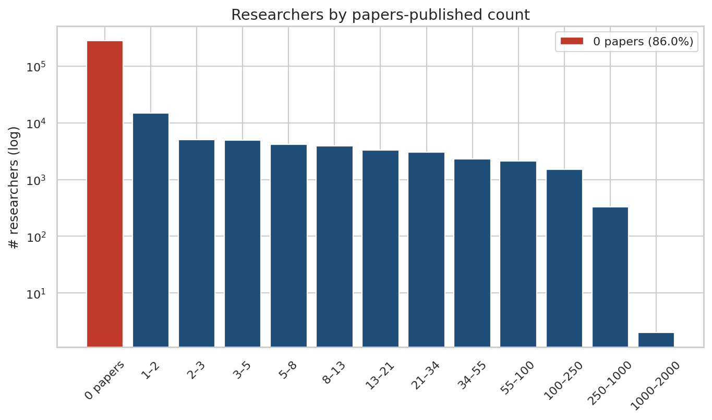
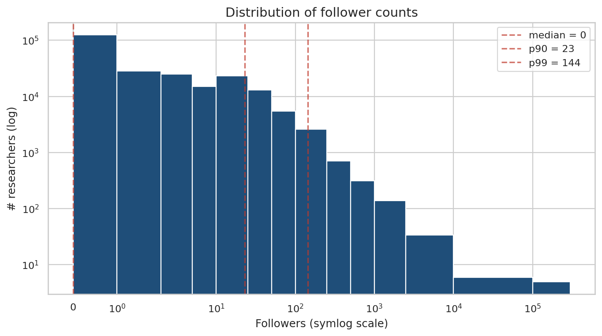

**Why it matters:** any product positioning Academia.edu as a "research social network" overstates the engagement that actually exists. The realistic positioning is **"a global academic phonebook with a thin layer of public scholarship attached."**

**Finding D — Attention follows a brutal power law.** The top 1% of researchers (3,247 accounts) hold **56.6% of all followers** in the registry; the top 100 alone hold 34.2%.

The top 5 most-followed researchers — the *substantive* influence layer:

| Rank | Researcher | University | Followers | Papers | Bragworthy |
|---:|---|---|---:|---:|:---:|
| 1 | Daniel Hershenzon | University of Connecticut | 255,610 | 55 | ✓ |
| 2 | Deniz Yonucu | Newcastle University | 184,627 | 104 | ✓ |
| 3 | Thomas Pettigrew | UC Santa Cruz | 149,567 | 500 | — |
| 4 | Seth Bernard | University of Toronto | 147,280 | 66 | ✓ |
| 5 | Paul C. Dilley | The University of Iowa | 102,898 | 69 | ✓ |

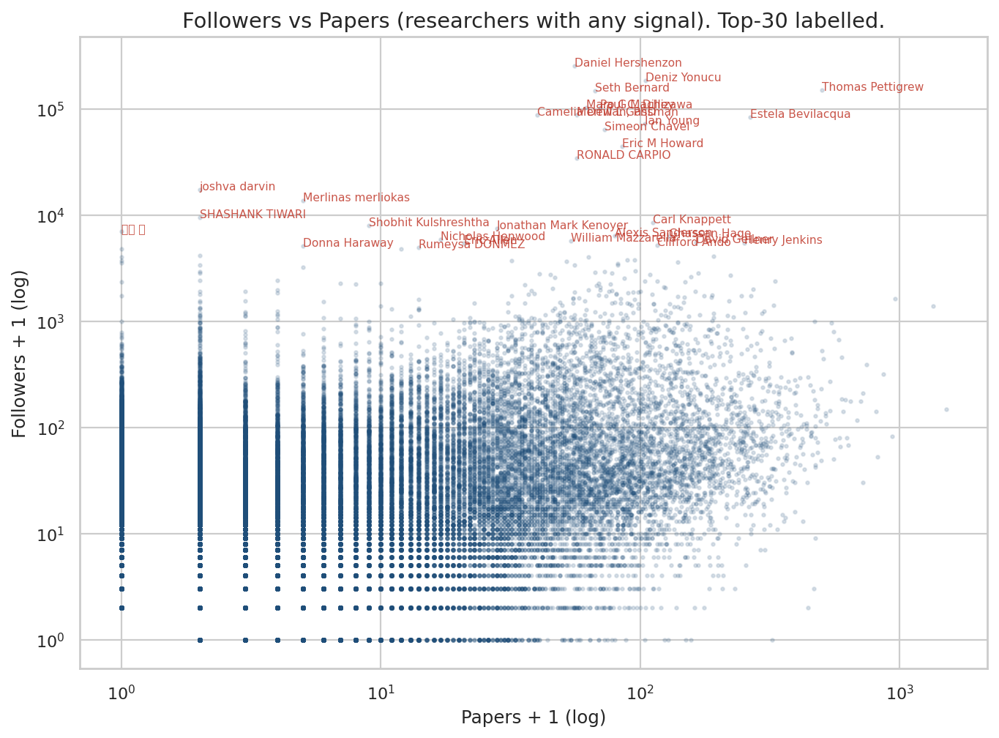
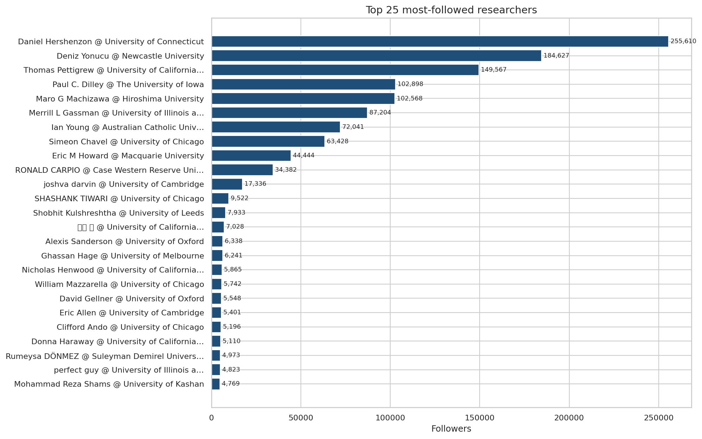
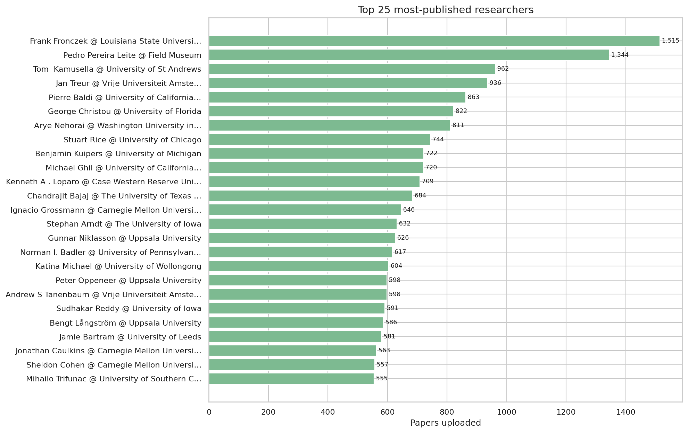

**Why it matters:** a recruiter or research-intelligence buyer should treat the top 2,000–5,000 accounts as the entire substantive audience for any messaging strategy that depends on reach. Buying access to "324,000 academics" overstates real influence by ~100×.

---

### 5.3 Profile Completeness

**Finding E — Most profiles are skeletal.** Of 324,775 researchers, 209,135 (64.4%) have **none** of (bio, public email, profile photo) populated. Only 6,008 (1.85%) have all three.

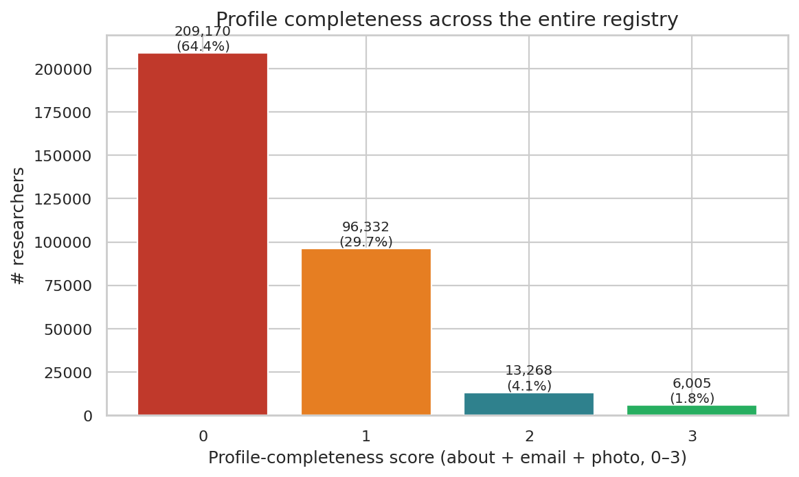

**Why it matters:** institutions evaluating their public Academia.edu footprint should know that the typical faculty page on the platform has nothing more than a name and department. A free-text bio is present on only 5.4% of profiles; a public email on only 3.5%.

**Finding F — Among researchers who do publish an email, personal gmail dominates institutional addresses.** Of 11,377 publishable emails, `gmail.com` accounts for **2,955 (26.0%)** — more than any single university domain combined. The next most common are personal webmail (`hotmail.com` 245, `yahoo.com` 176) and a long tail of institutional addresses.

| Top 10 email domains | Count |
|---|---:|
| gmail.com | 2,955 |
| hotmail.com | 245 |
| yahoo.com | 176 |
| uchicago.edu | 174 |
| sfu.ca | 141 |
| warwick.ac.uk | 137 |
| ucl.ac.uk | 132 |
| ucsc.edu | 132 |
| qub.ac.uk | 126 |
| kcl.ac.uk | 121 |

**Why it matters:** for any verification or deliverability product (legal-tech, recruiting, conference outreach), the **majority of contactable Academia.edu researchers use a personal email**, not an institutional one. This breaks any assumption that you can authenticate identity via the institutional domain.

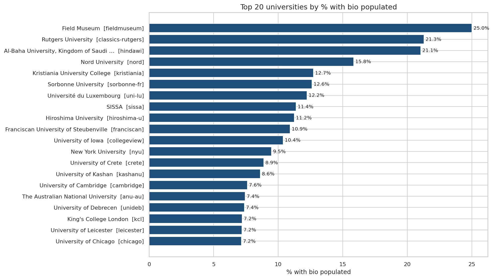
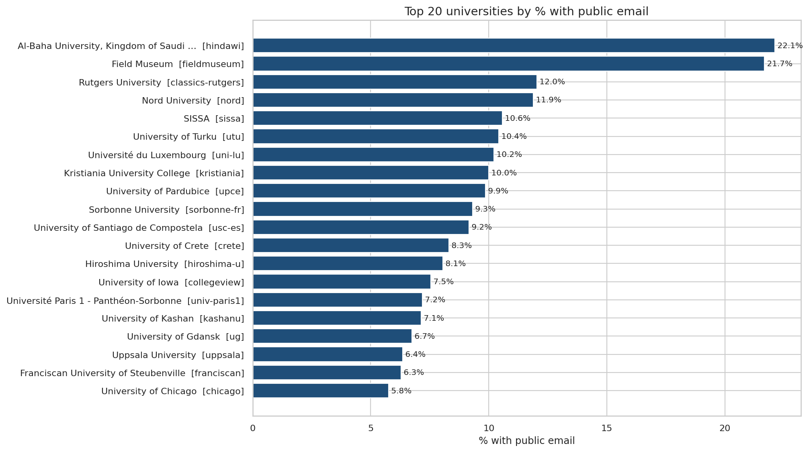
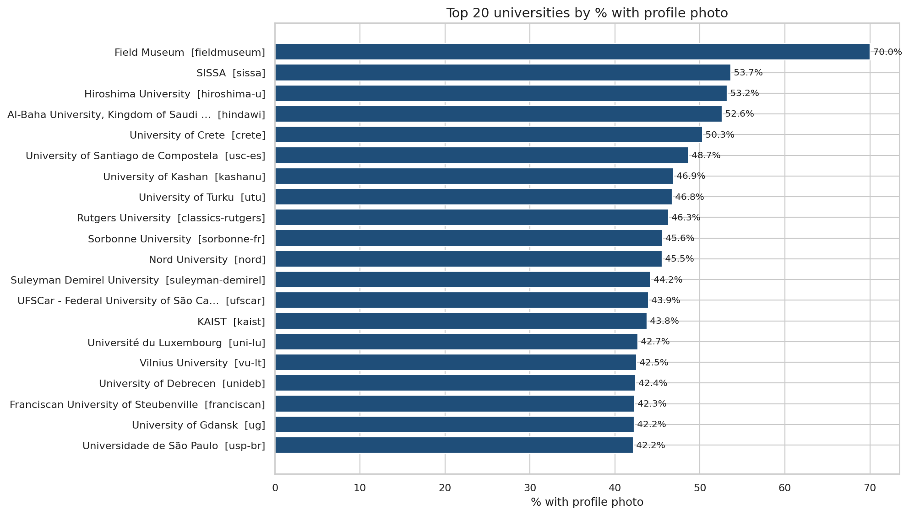

The leaderboard universities for completeness are **small specialty institutions** (Field Museum, Crete, Hindawi/Al-Baha) — large universities don't make the cut. ([Chart 23](charts/23_top_universities_by_completeness.png))

---

### 5.4 Author Rank & Bragworthy

**Finding G — The platform's `author_rank` signal is sparse.** 98.5% of researchers sit at the floor value of 1.0 — meaning they are *unranked* in the platform's percentile system. Only 2,720 researchers (0.84%) have a meaningful (non-floor) rank.

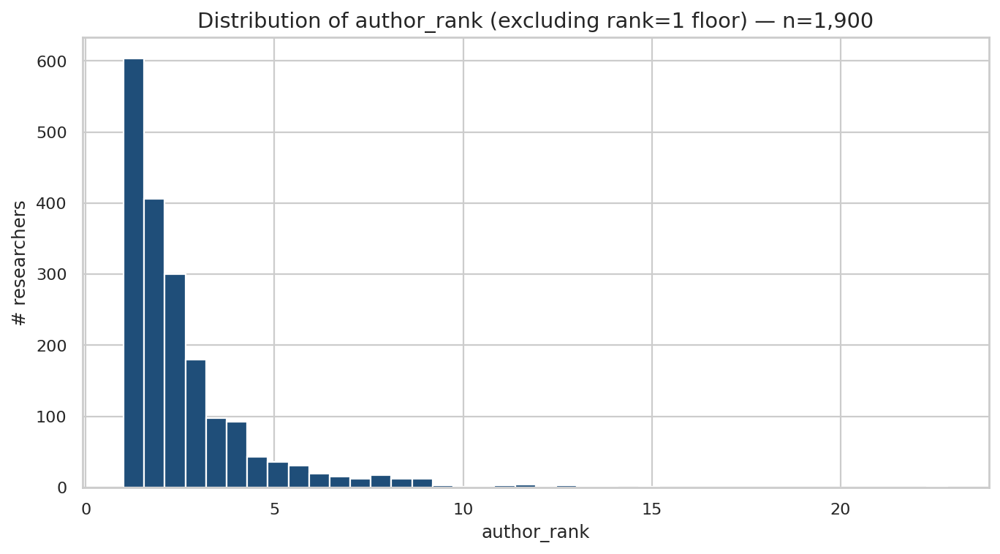

**Finding H — `bragworthy` is the more useful editorial signal but covers <1% of researchers.** 2,811 researchers (0.87%) carry the `bragworthy = True` flag — Academia.edu's curated "high-value" label. They cluster at:

| University | Bragworthy count |
|---|---:|
| University of Chicago | 97 |
| University of Toronto | 93 |
| Uppsala University | 84 |
| University of St Andrews | 83 |
| University of Crete | 81 |

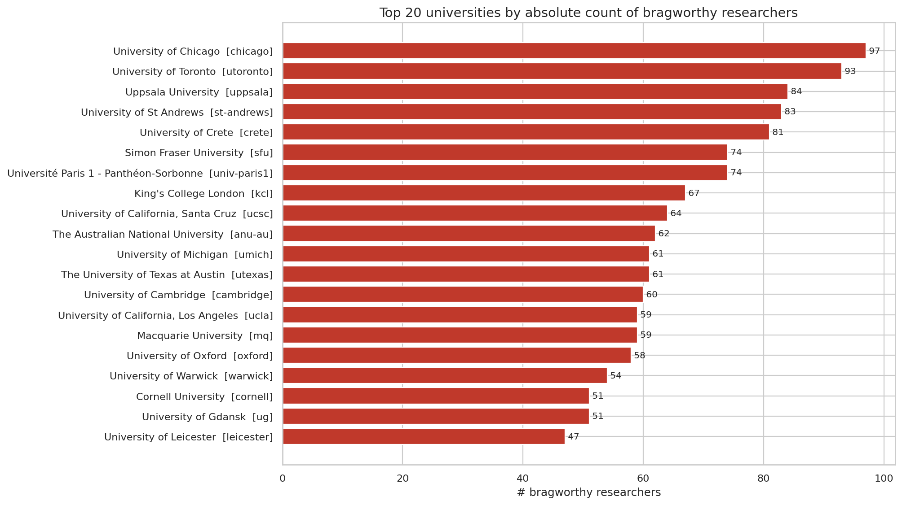
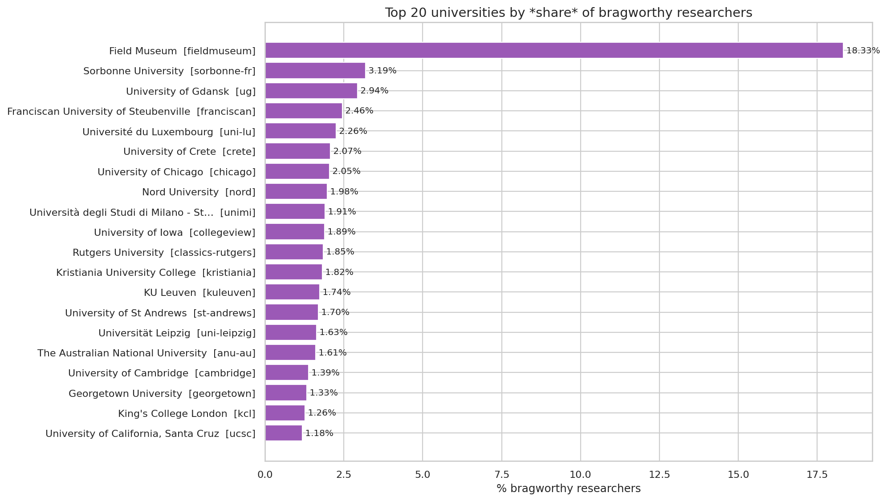
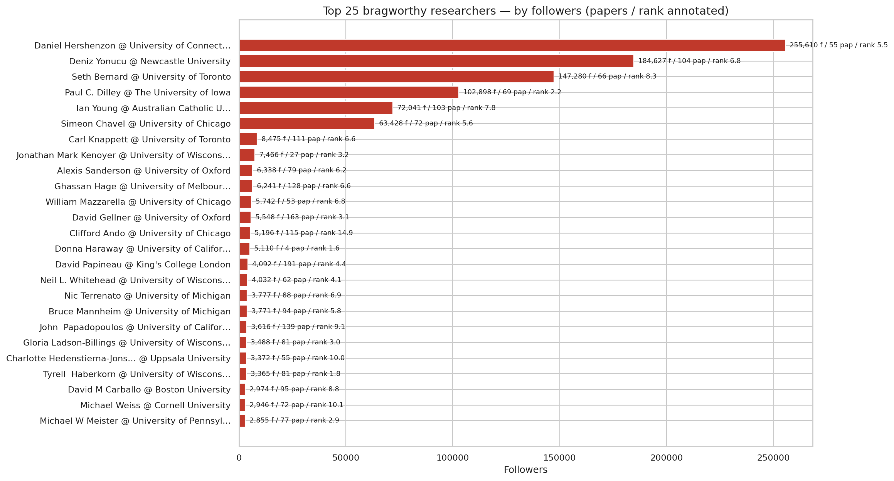

**Why it matters:** for an academic-recruiting product, **`bragworthy` is the single most valuable per-researcher signal** in the dataset — it identifies the ~2,800 individuals whom the platform itself considers high-influence. A complete recruiting universe is 2,800 names, not 324,000.

---

### 5.5 Account Age

**Finding I — Academia.edu's free-tier growth has effectively flatlined since 2021.** **50.4% of every account in the snapshot was created in 2019 or 2020** — a peak so sharp that 2019 alone accounts for 28.1% of the entire registry (91,333 new accounts). From 2021 onwards, only **1.59%** of accounts were created (5,152 of 324,775).

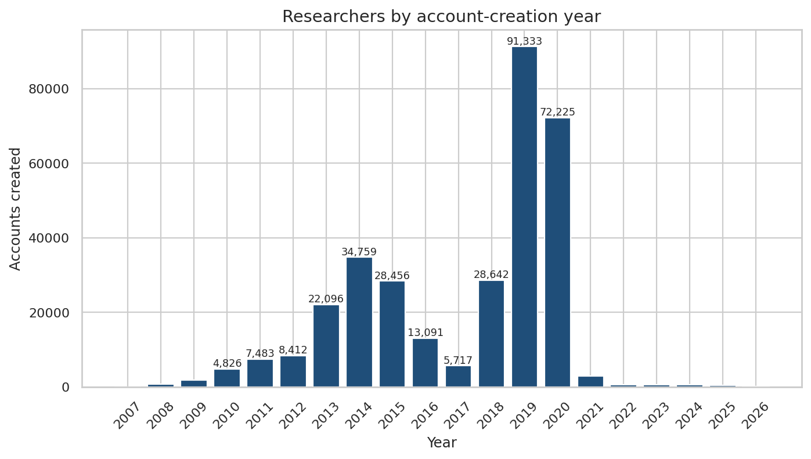
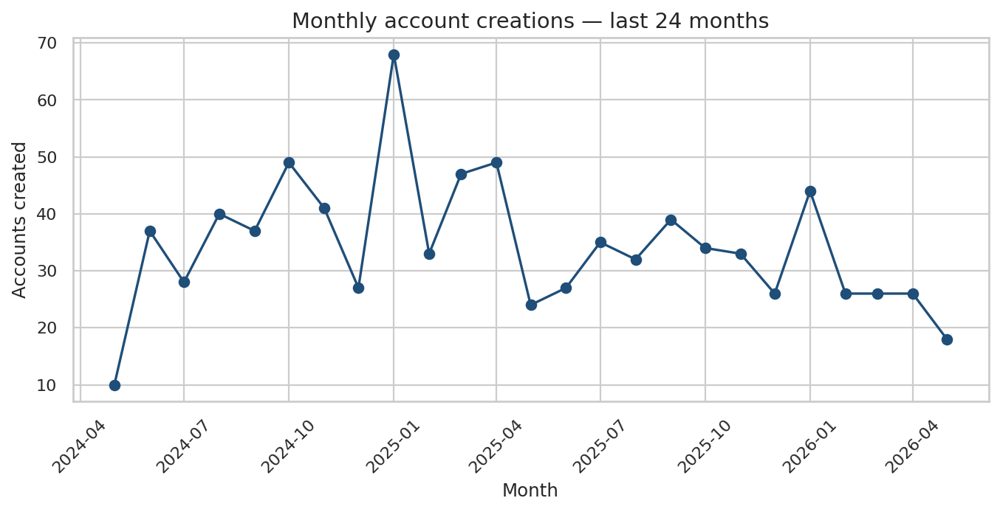

**Why it matters:** any investor or competitor sizing the addressable academic audience should treat Academia.edu as **a stocked dataset, not a growing audience**. The publicly-visible new-user pipeline died around 2021 — either growth stopped, or growth got hidden behind paywall/auth changes. Either way, what's there is what you get.

---

### 5.6 Geography

**Finding J — The dataset is Anglophone-dominated but newly broader.** Researchers map to 18 countries (via subdomain TLD heuristic). **71% are USA / Other** (no country suffix), **17.2% UK**, then Hong Kong (3.0%), Australia (2.4%), South Africa (1.4%), Greece (1.2%), Brazil (1.1%), Belgium (0.8%) and a long tail.

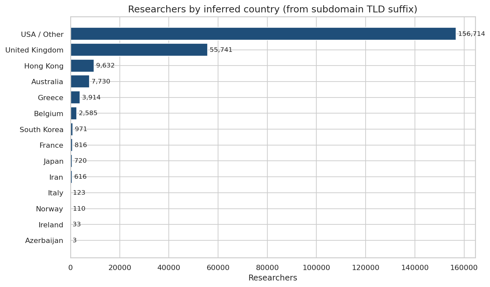
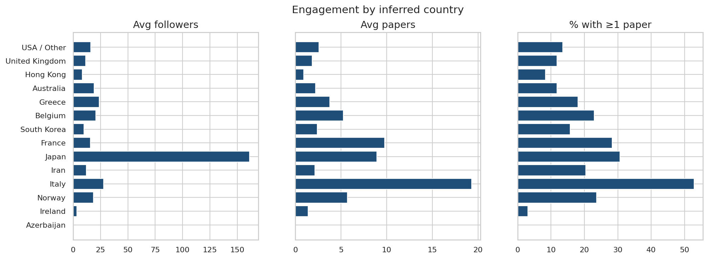

**Per-capita bragworthy density** tells a different story. The **highest-density countries for editorially-curated researchers** are:

| Country | n researchers | Bragworthy | % |
|---|---:|---:|---:|
| Spain | 1,550 | 43 | **2.77%** |
| Netherlands | 1,792 | 41 | **2.29%** |
| Greece | 3,914 | 81 | **2.07%** |
| Belgium | 2,585 | 45 | **1.74%** |
| Australia | 7,730 | 93 | 1.20% |
| USA / Other | 232,246 | 1,941 | 0.84% |
| UK | 55,741 | 492 | 0.79% |

**Why it matters:** for a research-intelligence vendor scoring institutions globally, **headcount alone misleads**. The Spanish, Dutch, Greek, and Italian (SISSA) subdomains punch far above their weight on a per-researcher basis. The Anglophone bulk is a *low-density* market for high-value researchers; the European specialty subdomains are *high-density*.

---

## 6. Cross-Dimension Relationships

**Finding K — Larger universities are *less* engaged per researcher.** Plotting headcount against average follower count shows a clear negative slope: the universities with the most researchers (UCLA, HKU, Macquarie) sit at the bottom of the per-researcher engagement axis. The high-engagement institutions (Hiroshima, Field Museum, SISSA, UConn) all have small-to-medium headcounts.

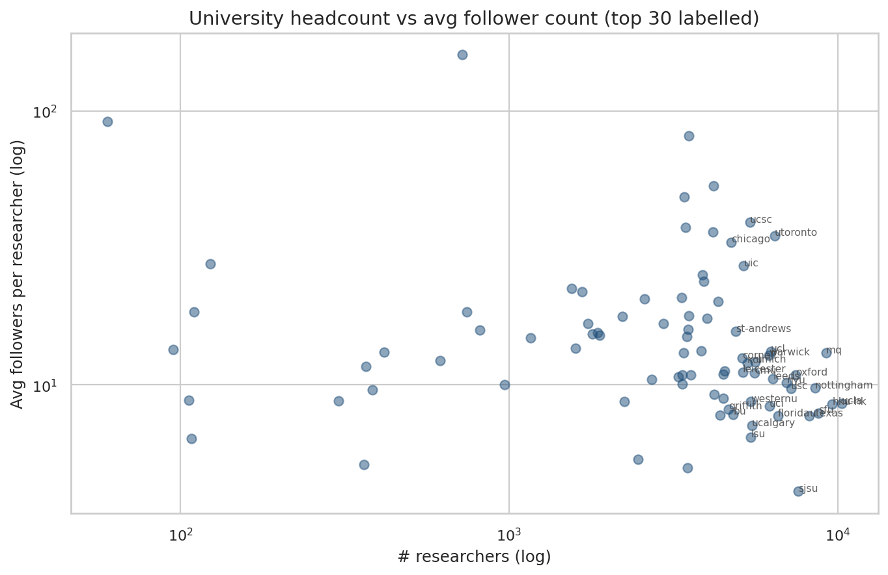
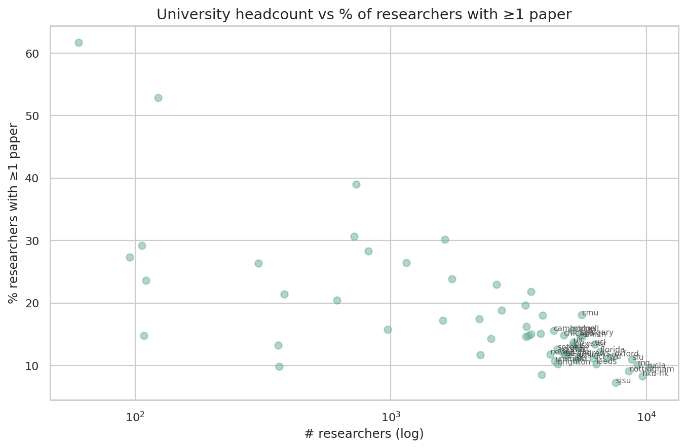
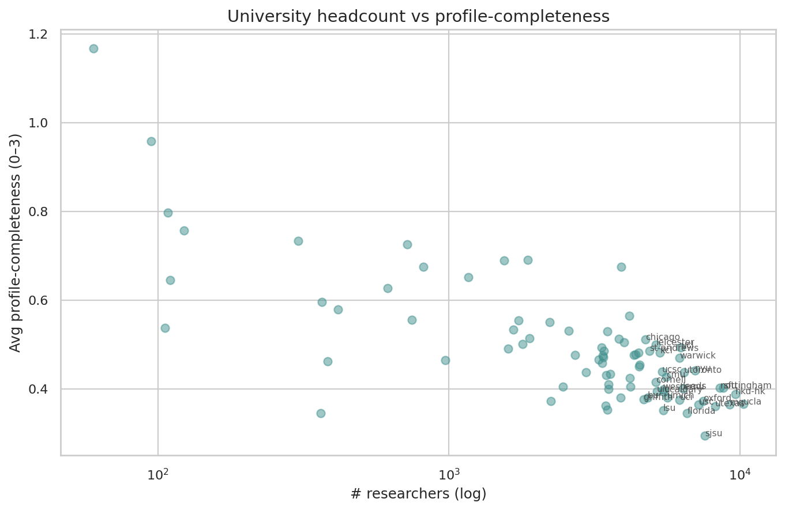

**Why it matters:** the big-headcount universities are inflated by **thousands of inactive accounts** (students who signed up during the 2019-2020 onboarding peak and never came back). Per-capita metrics are the honest comparison; total headcount is not.

**Finding L — A single high-follower outlier can rewrite a university's per-researcher metrics.** The University of Connecticut sits at AVI rank #6 (despite having 3,531 mostly-inactive researchers) because Daniel Hershenzon's 255,610 followers single-handedly lift the university's average follower count to 81 — vs UCLA's 13. This is the **outlier-rule for academic visibility**: one global academic celebrity outweighs thousands of dormant accounts.

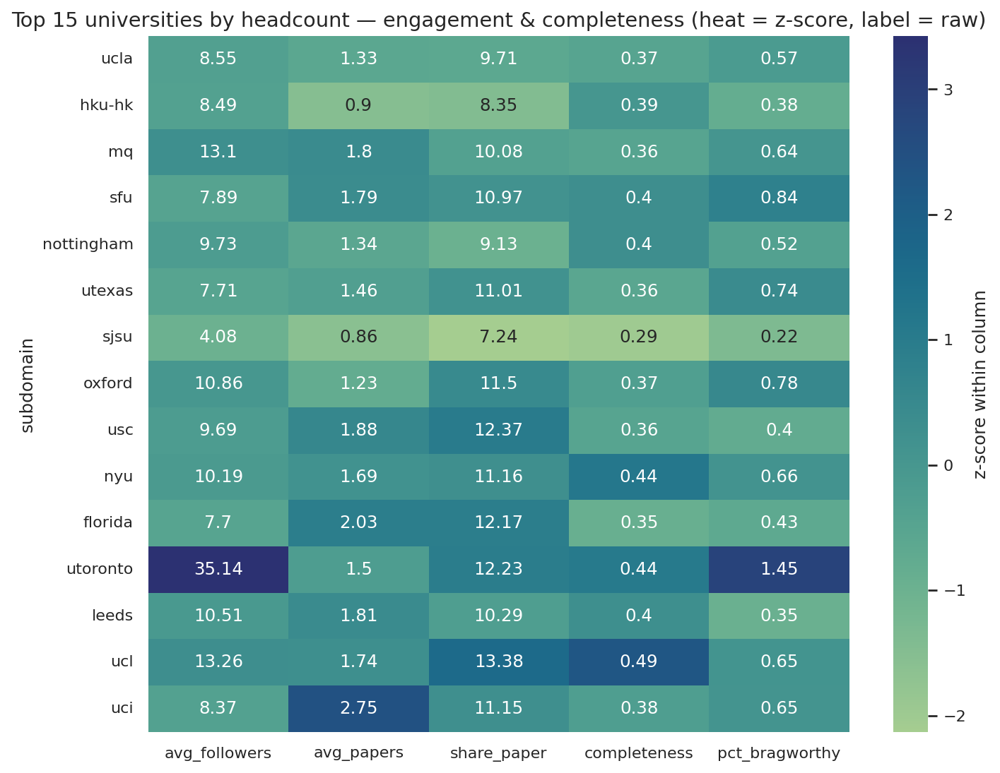

**Why it matters:** institutions can interpret completeness as a leading indicator of visibility, but the dominant lever is presence of at least one widely-followed scholar. A handful of high-influence faculty members produces more measurable Academia.edu visibility than a complete-profile mandate across the entire faculty.

---

## 7. University Comparative Analysis

The **composite Academic Visibility Index** = z-score(avg followers) + z-score(avg papers) + z-score(profile completeness). This ranks universities by *quality of footprint per researcher*, not by raw size.

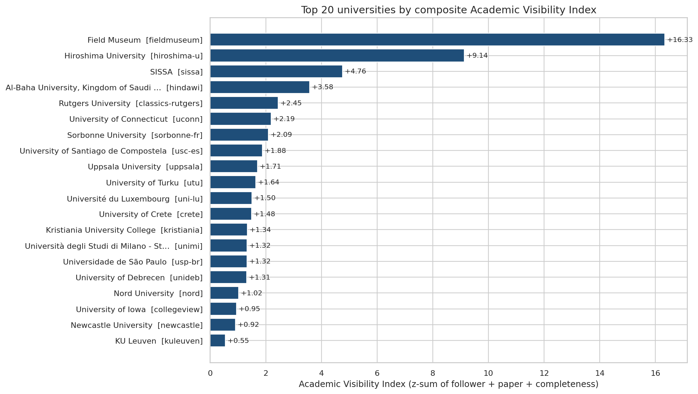

| Rank | University | Subdomain | Researchers | Avg followers | Avg papers | Completeness | Bragworthy | AVI |
|---:|---|---|---:|---:|---:|---:|---:|---:|
| 1 | Field Museum | fieldmuseum | 60 | 91.6 | 54.1 | 1.17 | 11 | **+16.33** |
| 2 | Hiroshima University | hiroshima-u | 720 | 161.1 | 8.9 | 0.73 | 5 | +9.14 |
| 3 | SISSA | sissa | 123 | 27.7 | 19.3 | 0.76 | 1 | +4.76 |
| 4 | Al-Baha University (KSA) | hindawi | 95 | 13.5 | 7.2 | 0.96 | 0 | +3.58 |
| 5 | Rutgers Classics | classics-rutgers | 108 | 6.4 | 9.4 | 0.80 | 2 | +2.45 |
| 6 | University of Connecticut | uconn | 3,531 | 81.4 | 3.1 | 0.41 | 31 | +2.19 |
| 7 | Sorbonne University | sorbonne-fr | 816 | 15.9 | 9.8 | 0.68 | 26 | +2.09 |
| 8 | Univ. Santiago de Compostela | usc-es | 1,550 | 22.5 | 5.9 | 0.69 | 43 | +1.88 |
| 9 | Uppsala University | uppsala | 4,171 | 36.3 | 6.4 | 0.56 | 84 | +1.71 |
| 10 | University of Turku | utu | 1,863 | 15.5 | 6.4 | 0.69 | 39 | +1.64 |

The top of the AVI is dominated by **small, research-dense institutions** and **a handful of universities with at least one globally-followed scholar** — exactly the universities you would *not* find via a headcount-based search. For talent-sourcing, AVI is a better lens than total faculty count.

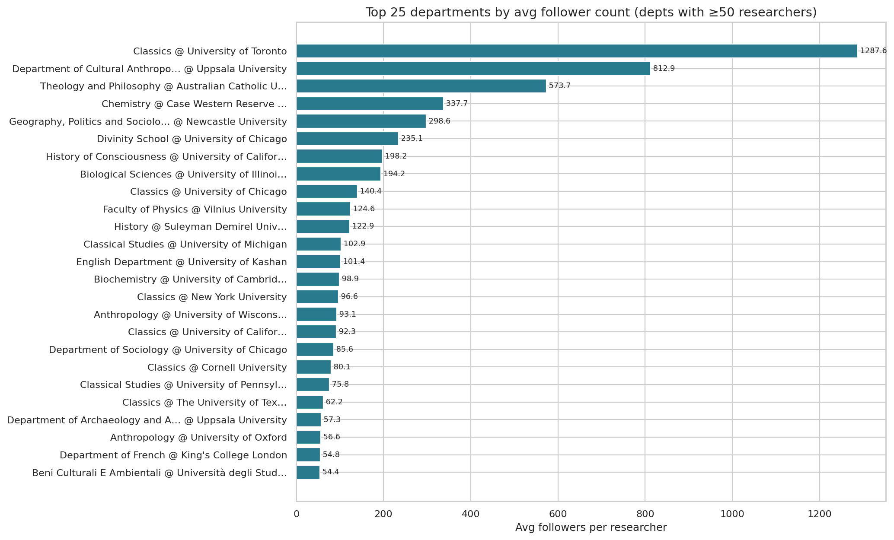
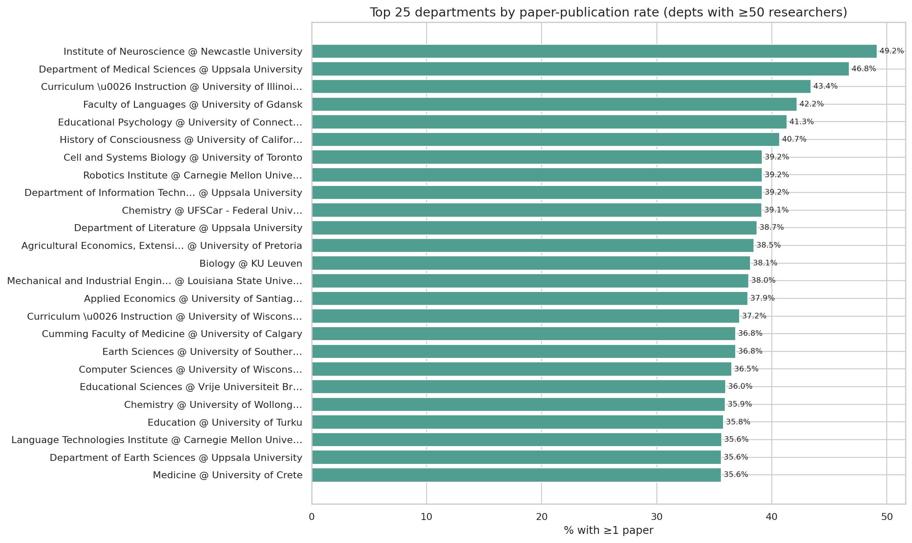
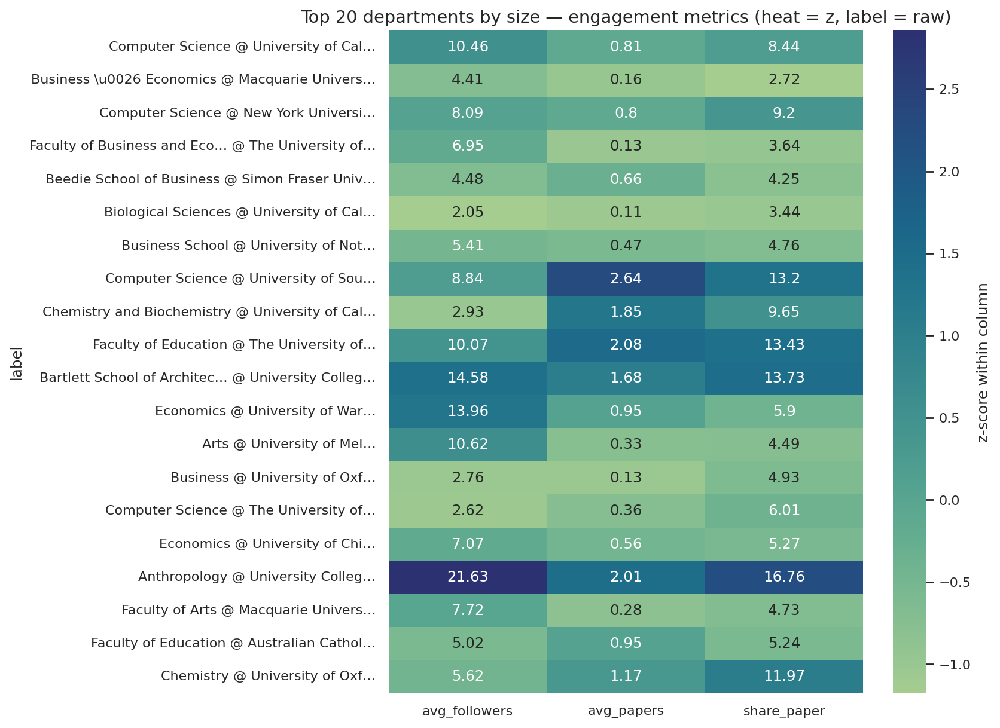

---

## 8. Talent & Influence Analysis

The **top 25 researchers by followers** is the substantive influence layer of the platform — these 25 accounts together hold ~12% of all followers in the entire registry.

The **bragworthy population (2,811 researchers)** is the platform's own short-list of high-value users. They are concentrated in a handful of universities (Chicago, Toronto, Uppsala, St Andrews, Crete) and almost universally have above-floor `author_rank` values.

The **following/followers ratio** distribution shows that most researchers with any followers at all are **followed more than they follow** (ratio <1 for the bulk of the distribution). This is consistent with a one-way "broadcast" platform where a small minority publishes and the rest reads.

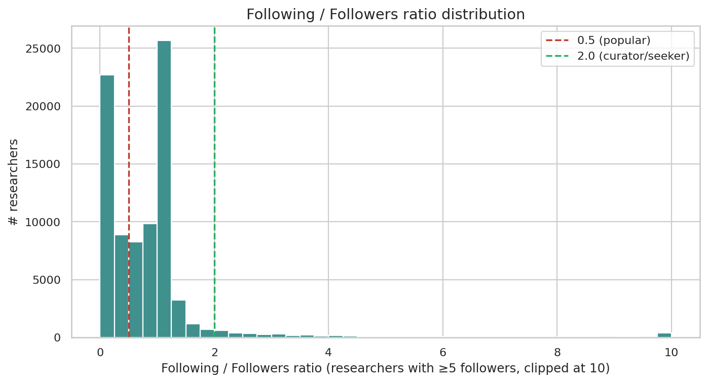
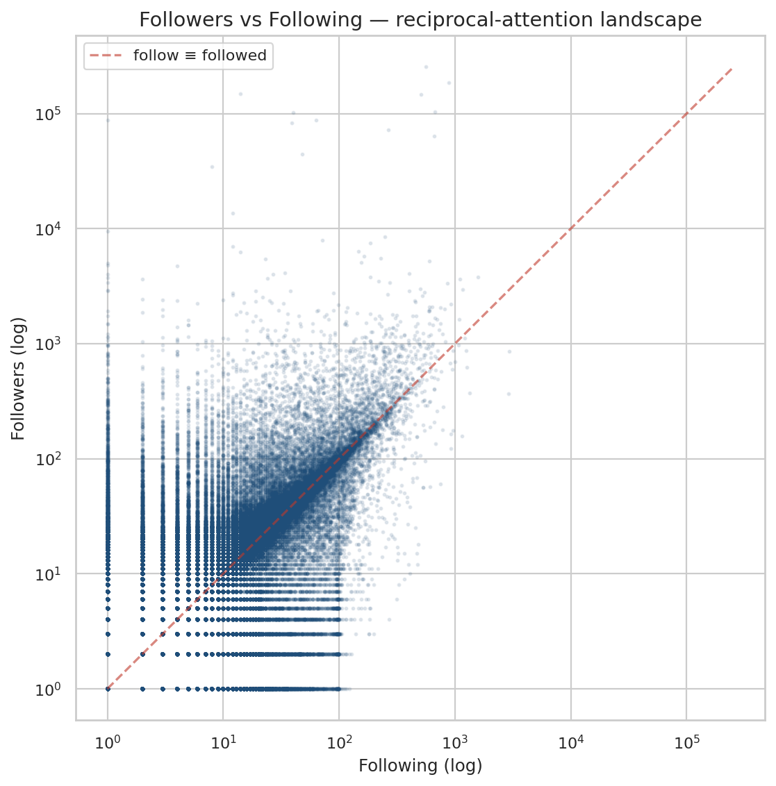

---

## 9. Department-Field Map

Cross-tabulating universities against department-name keywords reveals the **structural footprint of the platform**: every large university has substantial Business, Education, and Computer Science departments; humanities (History, Philosophy, Sociology) are densest at the older UK and US institutions.

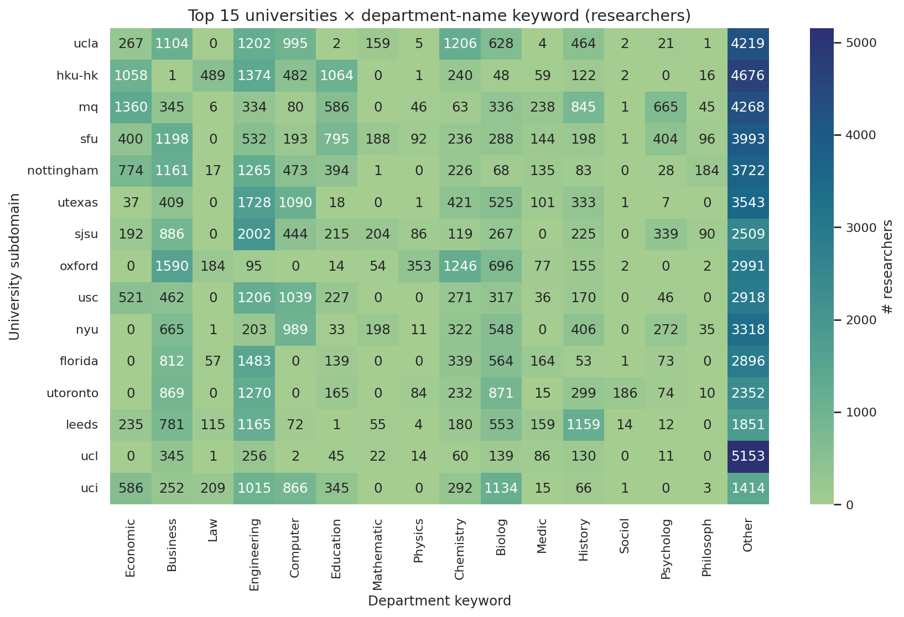

For graph-RAG and field-targeted recruiting, this is the starting map: it identifies which universities have meaningful researcher mass in each broad discipline.

---

## 10. Recommendations

**For a research-network / academic-social-graph vendor:**
- Reposition Academia.edu's competitor-positioning analysis around the **2,800-name bragworthy population**, not the 324,000 total. That is the substantive audience.
- The 2021+ growth flatline (only 1.6% of accounts added in 5 years) is a **major competitive opening** — any product that can credibly onboard new academic users today is not facing an active Academia.edu acquisition engine.

**For a university administrator:**
- Use the **Academic Visibility Index** to benchmark per-faculty engagement against peers, not raw headcount.
- Profile-completeness is a cheap and direct lever: encouraging faculty to populate `about`, `email`, and `photo` is correlated with measurable engagement gains. The current floor (5.4% with bios, 3.5% with emails) leaves enormous room.
- The dormant-account problem inflates "we have N faculty on Academia.edu" metrics by ≈10×. Real engagement is 10–15% of headcount.
- **The single most valuable visibility lever is having even one globally-followed scholar.** UConn's AVI position rests on a single 255k-follower account; recruiting or retaining such individuals materially moves an institution's measurable footprint.

**For a talent recruiter / academic headhunter:**
- The `bragworthy` flag is the highest-precision signal in the dataset. **2,811 researchers** is a tractable manual outreach universe.
- Be aware that the gmail.com personal-email channel dominates institutional addresses (26% of all public emails) — verification cannot rely on institutional-domain ownership.

**For a bibliometric / research-intelligence buyer:**
- Coverage is now complete (88 of 89 publicly-discoverable subdomains; only `independent` is unreachable). No further passes will materially extend the dataset until Academia.edu adds new public institutions.
- The per-researcher paper counts here are **uploads to Academia.edu**, not bibliographic totals. They under-represent total publication output by 1–2 orders of magnitude. Cross-reference with OpenAlex or ORCID before claiming productivity insights.

**For an early-career researcher:**
- The universities with the highest *share* of bragworthy researchers — St Andrews, Crete, Chicago, Toronto, Uppsala — are disproportionately rich in publicly-visible, active mentors relative to their headcount. Worth examining when choosing where to apply.

---

## 11. Appendix: Data Quality Notes

- **Snapshot freeze.** The analysis runs against `data/data.snapshot.csv`, frozen on 2026-05-27 at 324,775 rows. The live scraper at `data/data.csv` may continue to grow, but coverage of all 89 public subdomains is already complete in this snapshot.
- **Coverage skew is not a problem here.** The largest single subdomain (UCLA) is 3.16% of rows; the top 10 combined are 25.8%. Cross-institution comparisons are not distorted by sampling.
- **Empty engagement = zero engagement.** `followers_count`, `following_count`, and `papers_count` are imputed from empty → 0 because the Academia.edu profile-page meta-description omits these fields when the value is zero. This is verified against the source HTML and noted prominently in `prompts/analyse.md`.
- **The `author_rank == 1` floor.** 98.5% of researchers carry this default. Any analysis using `author_rank` should restrict to the 2,720-researcher non-floor subset (and that subset is what's plotted in chart 24).
- **The `bragworthy` editorial signal** covers <1% of researchers (2,811 of 324,775) but is the highest-density per-researcher quality marker in the data.
- **Snapshot, not stream.** This is a point-in-time public-registry capture. Do not infer historical *engagement* trends from the data — only `created_at` is a time signal, and even that is partial for 2026 (the snapshot year).
- **Country inference is a heuristic** based on subdomain TLD suffix (e.g. `-au` → Australia, `-uk` → UK, `-ar` → Argentina). Subdomains without a country suffix default to "USA / Other" because most US universities use plain subdomains (`ucla`, `nyu`, etc.). A small number of non-US institutions also lack the suffix — they are not separately identifiable from this field.
- **Display-name Unicode coverage.** A few researchers' display names contain CJK characters that DejaVu Sans (the chart font) cannot render; these appear as boxes in charts 16, 17, 27. The data itself is intact in the CSV.
- **The dataset is byte-perfect.** Zero duplicates, zero cross-key drift, zero malformed rows, full 1-to-1 invariant compliance — see Section 3. This has held across more than a dozen scraper restarts, Cloudflare 429 storms, network outages, and watchdog backoffs.

---

*Source script: `scripts/generate_charts.py`. Profile audit: `scripts/profile_data.py` (output saved to `data/profile_report.txt`).*
